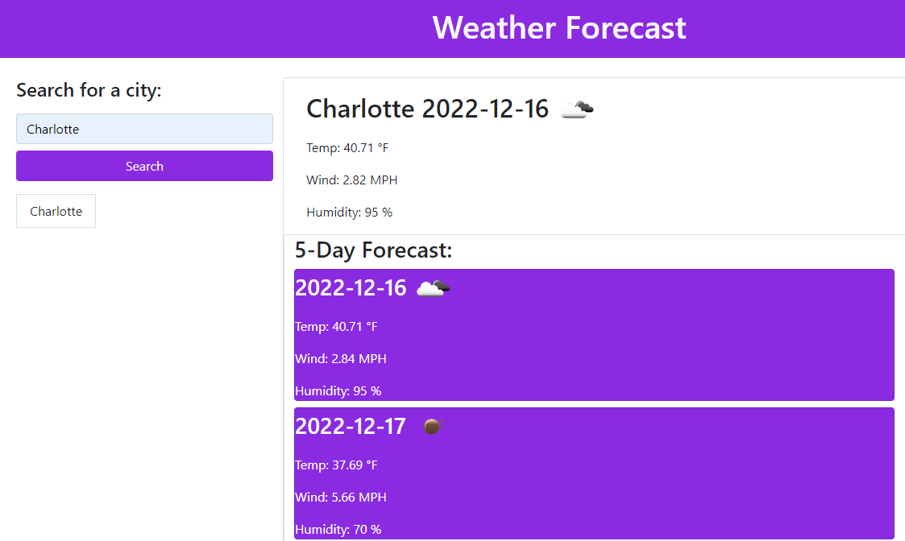

# weather-forecast

[Link to my project](https://github.com/Deiontre10/weather-forecast)

## Table of Contents
- [Description](#description)
- [Visuals](#visuals)

## Description
Weather Forecast is an easy to use application which generates today’s weather conditions, including temperature, wind speed and humidity. You can generate forecasts up to 5 days into the future. This is for any city you search for so if you have a vaction planned we've got you covered.

Product Features: 
- Generates current weather conditions, including temperature, wind speed and humidity.

- Generates a 5 day forecast.

- Saves the cities you search so you can recall them later at the click of a button even if you close the site.

## Visuals

